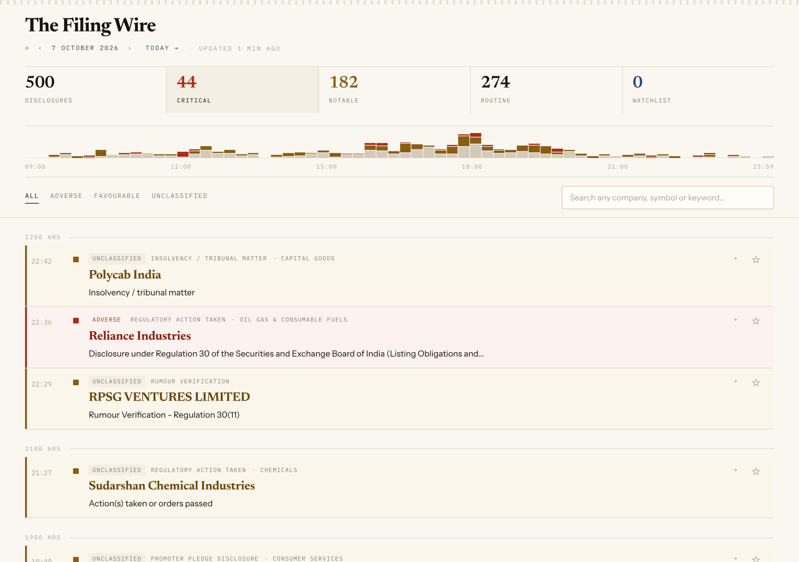
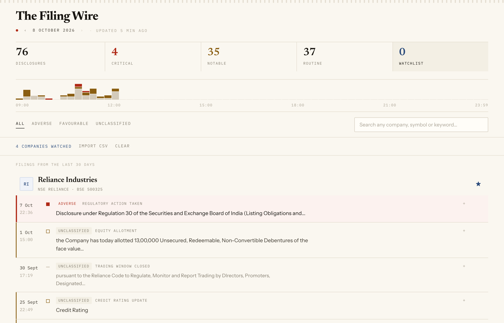
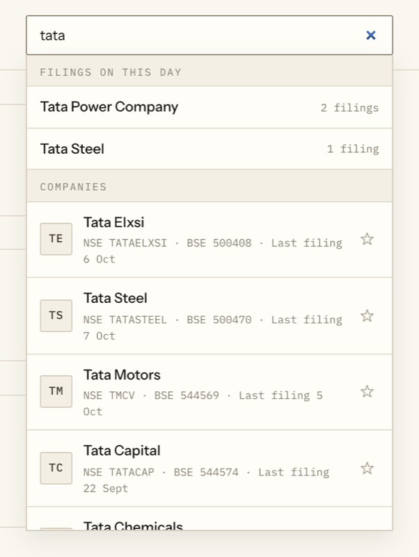
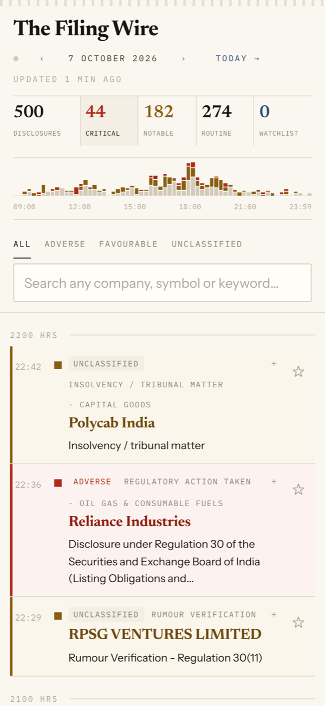
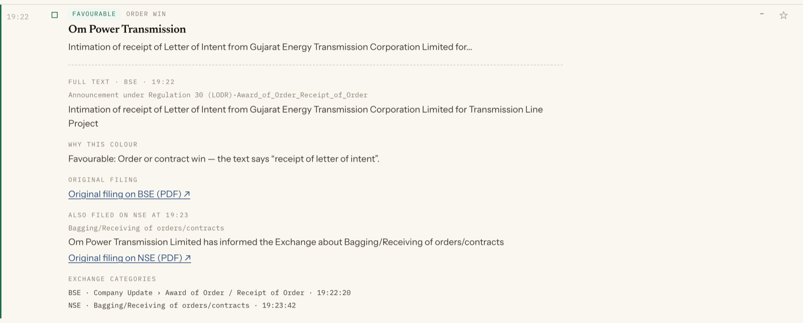
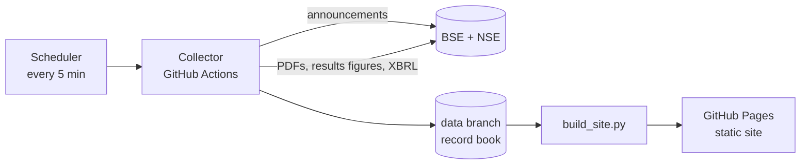

<h1 align="center">The Filing Wire</h1>

<p align="center">
  A live, rules-based feed of corporate disclosures from India's two stock exchanges, BSE and NSE.
</p>

<p align="center">
  <a href="https://vandanlalwani-git.github.io/filing-wire/"><strong>Open the live site →</strong></a>
</p>

<p align="center">
  <a href="https://github.com/vandanlalwani-git/filing-wire/actions/workflows/collector.yml"></a>
  
  
  
  
</p>

<p align="center">
  
</p>

---

Every announcement a listed company files with BSE or NSE appears here
within minutes as a single line. Each line's **colour** shows its direction
(Adverse, Favourable or Unclassified), and its **weight** shows how much it
matters (Critical, Notable or Routine). A filing made on both exchanges is
shown once.

Every decision comes from a fixed, published set of rules that has been
tested against hand-labelled filings. No AI model is called at runtime. When
the rules cannot tell whether news is good or bad, the filing stays
**Unclassified** rather than guessed.

> **Disclosure events only, classified by fixed rules. Not investment advice.**

## Contents

- [Features](#features)
- [How a filing gets its colour](#how-a-filing-gets-its-colour)
- [How it works](#how-it-works)
- [Data sources](#data-sources)
- [Repository layout](#repository-layout)
- [Running it locally](#running-it-locally)
- [Operations](#operations)
- [Limitations](#limitations)
- [Disclaimer](#disclaimer)

## Features

| | |
|---|---|
| **Live feed** | Updates about every 5 minutes. The header shows how fresh the data is, and a notice appears if an exchange could not be reached. |
| **One line per event** | BSE and NSE copies of the same announcement are paired and shown once; the other exchange's version stays one tap away. |
| **Explained colours** | Expand any row to see the full text, *why it got its colour* (the exact phrase or figures), the exchange categories and the original PDF. |
| **Quarterly results** | Results are coloured from reported figures, not wording: profit attributable to owners of the parent, year on year, with exceptional items taken into account. |
| **Search any listed company** | About 6,000 companies from NSE (main board and SME) and BSE (all groups, including suspended scrips). Search by name, NSE symbol, BSE code or ISIN. |
| **Watchlist** | Star any company. The Watchlist tab shows each one with its last 30 days of filings. Companies are matched by ISIN, so renames and spelling differences between exchanges don't break it. |
| **Broker CSV import** | Import a holdings export (e.g. Zerodha). Symbols, ISINs, BSE codes and company names are all recognised, and any rows not recognised are listed. |
| **90 days of history** | Step back through earlier days with the date controls. |
| **Phone-first** | Works on a 375px screen. The company list (≈150 KB) loads only when first needed, and a 10-company watchlist downloads about 30 KB. |
| **Private by design** | The watchlist is stored only in your browser. There are no accounts, cookies, trackers or analytics; the only third-party request is for web fonts (Google Fonts). |

<table>
  <tr>
    <td colspan="2"></td>
  </tr>
  <tr>
    <td colspan="2" align="center"><sub>Watchlist: each company with its last 30 days of filings</sub></td>
  </tr>
  <tr>
    <td width="50%" align="center"></td>
    <td width="50%" align="center"></td>
  </tr>
  <tr>
    <td align="center"><sub>Search any listed company</sub></td>
    <td align="center"><sub>Phone layout</sub></td>
  </tr>
</table>

## How a filing gets its colour

The decision is made in three layers, from the broadest to the most specific.

1. **Weight (severity).** This comes from the category the company filed
   under on each exchange, mapped in [`taxonomy.json`](taxonomy.json) and
   [`taxonomy_nse.json`](taxonomy_nse.json). Some headline phrases override
   the category.
2. **Direction (colour).** Phrase rules in [`events.py`](events.py) read the
   filing's own text and, where text alone is not enough, its PDF. Keywords
   match whole words or exact phrases only. Blocking phrases stop known false
   matches (for example, an order won by a holding company, or a sample
   order). If two rules point opposite ways, or if the BSE and NSE copies
   disagree, the filing stays Unclassified.
3. **Quarterly results.** These are decided by numbers in
   [`results.py`](results.py), as shown in the table below.

<p align="center"></p>

**Results rule** (same quarter, year on year; consolidated where available):

| Outcome | Colour |
|---|---|
| Profit up 10% or more and revenue not down | Favourable |
| Loss turned into a profit | Favourable |
| Profit down more than 10% | Adverse |
| Profit turned into a loss, or a bigger loss | Adverse |
| Smaller loss (still a loss), or a small or mixed change | Unclassified |
| More than half the profit change explained by exceptional items | Unclassified, marked "driven by exceptional item" |

For consolidated results, the profit used is the profit attributable to
owners of the parent. It is read from the company's XBRL filing on NSE. If
that figure is unavailable, total profit is used, and the expanded row says
which figure and basis applied.

### Which rules colour the feed

Twelve rules can colour a filing: the ten event rules below, a PDF check for
pledges, and the results rule. Each was switched on only after a blind test,
scoring at least 95% right on fresh filings that were labelled by hand
before the rule was run on them. The other 43 event rules still name the
event, but leave it Unclassified.

| Favourable | Adverse |
|---|---|
| Order or contract win | Tax or regulatory demand or penalty |
| Credit rating upgraded | Statutory auditor resigned |
| Plant commissioned or production started | Fire or accident at a facility |
| Pledge released | Pledge created or invoked |
| New buyback approved by the board ¹ | Independent director resigned citing governance concerns ¹ |
| Quarterly results (by the figures) | Quarterly results (by the figures) |

¹ *Rare events.* These are too rare for a full blind test. They were
switched on after giving no wrong colour on every filing available. Every
time one of them colours a filing, it is logged to `rare_rules_log.json` for
review, and the rule is switched off if it is ever wrong.

The hand-labelled test set (463 filings) and its labelling conventions are
in [`tests/`](tests/); see [`tests/LABELLING.md`](tests/LABELLING.md).

## How it works



- **Collector** ([`run.py`](run.py), [`.github/workflows/collector.yml`](.github/workflows/collector.yml))
  - A *quick* run reads only BSE pages until it reaches filings it has
    already seen, plus NSE's day list.
  - A *full* run, on the first run of each hour and at about 23:45 IST,
    re-reads the whole day.
  - Each run classifies new filings and pairs cross-listed duplicates.
  - It reads at most 40 PDFs per run, and only where a rule needs one.
  - Nothing is ever deleted from the record book. If an exchange fails,
    existing rows are kept and the failure is recorded in `status.json`.
- **Record book** (the `data` branch) holds one commit, replaced on each run:
  - `book/`: every filing, with what later runs need;
  - `days/`: what the site shows;
  - caches for PDFs and results figures;
  - the company directory and status.
- **Site** ([`build_site.py`](build_site.py), [`web/`](web/))
  - Day files, per-row details loaded only when a row is expanded, the
    company directory, and per-company 30-day indexes split into 512 small
    files, so a phone downloads only what it shows.
  - The screen polls for changes every 60 seconds.
- **Watchdog.** A separate job, outside the collector's queue, cancels a run
  that has waited more than 15 minutes for a machine, so a stuck run cannot
  stall the feed.
- **Publishing safeguard.** Before anything is published, a check refuses to
  publish if the record book contains anything that looks machine-specific.

## Data sources

All sources are free and public, and none needs a key or login.

| Source | Used for |
|---|---|
| BSE corporate announcements (via the [`bse`](https://pypi.org/project/bse/) package) | Filings, categories, attachments |
| NSE corporate announcements | Filings, categories, attachments |
| Filing PDFs on BSE / NSE | Order wins, pledges, commissioning and other events the text alone can't settle |
| BSE structured financial results | Revenue, profit and exceptional items for quarterly results |
| NSE integrated filing XBRL | Profit attributable to owners of the parent |
| NSE `EQUITY_L.csv` and `SME_EQUITY_L.csv`; BSE list of scrips (active and suspended) | Company directory, refreshed daily |

Requests are paced (at least 0.5 s between BSE pages), and every request has
a timeout.

## Repository layout

```
├── run.py              Collector: fetch, classify, pair, enrich, colour, write
├── classify.py         BSE category → label / severity / direction
├── merge.py            NSE classification; pairing BSE ↔ NSE duplicates
├── events.py           Phrase rules (53), whole-word matching, PDF checks
├── enrich.py           PDF text: amounts, pledge details
├── results.py          Quarterly results from reported figures
├── directory.py        Company directory from NSE and BSE lists
├── build_site.py       Assembles the static site from the record book
├── taxonomy*.json      Exchange category → severity and direction
├── sector_map.json     Symbol → sector
├── bse_securities.json BSE Group A reference list
├── tests/              Hand-labelled test set and labelling conventions
├── web/                The screen (React 18 + Vite + Tailwind)
├── docs/images/        Screenshots used in this README
├── probe.py            One-off check that GitHub can reach BSE and NSE
└── .github/workflows/  collector.yml (every 5 min), probe.yml (manual)
```

## Running it locally

Requirements: Python 3.9 or later and Node 22.

```bash
pip install -r requirements.txt
```

Collect today's filings into a local record book (`data/` is git-ignored):

```bash
python run.py --data-dir data --mode quick
```

Build the screen and the site, then preview it:

```bash
(cd web && npm ci && npm run build)
python build_site.py --data-dir data --out site --app web/dist
python -m http.server 8000 --directory site
```

Other collector modes:

| Command | What it does |
|---|---|
| `python run.py --data-dir data --mode full` | Re-read the whole day |
| `python run.py --data-dir data --day 2026-09-15` | Rebuild a past day |
| `python run.py --data-dir data --repair FROM TO` | Re-colour past days after a rule change |
| `python run.py --data-dir data --no-enrich` | Never download a PDF |
| `python directory.py --data-dir data` | Refresh the company directory now |

## Operations

**Schedule.** A free external scheduler triggers the collector every 5
minutes, and GitHub's own schedule runs as a backup. GitHub sometimes starts
runs late, so the site typically updates every 5 to 30 minutes.

**If the site says "Updated N hours ago":** GitHub pauses scheduled
workflows in repositories with no activity for 60 days. To resume:

1. Open **Actions → Collector** in this repository.
2. If the workflow is disabled, click **Enable workflow**.
3. To update immediately, click **Run workflow** and keep the defaults.

If the workflow is enabled but the site is still stale, open the newest run
in the list (it will have a red mark) to see the error. The site keeps
showing the last good data in the meantime.

**Results-season review.** From 7 to 21 October 2026, the collector writes
`reviews/results-<day>.md` on the `data` branch. It lists every coloured
result with the figures behind it, for checking by hand against the filings.

## Limitations

- **Fixed rules can be wrong.** They are deliberately cautious, so most
  filings stay Unclassified.
- **NBFC and insurer results** use formats that BSE's structured figures do
  not cover yet, so these results stay Unclassified.
- **Timing.** It depends on GitHub's free runners and on the exchanges'
  public endpoints. A delay is shown on the page, never hidden.
- **Retention.** History is kept for 90 days.

## Disclaimer

The Filing Wire summarises public disclosures. It is not investment advice,
a recommendation, or a substitute for reading the filing. The original
filing on BSE or NSE is the authoritative source, and every row links to it.
All filings and figures belong to their respective companies and exchanges.
